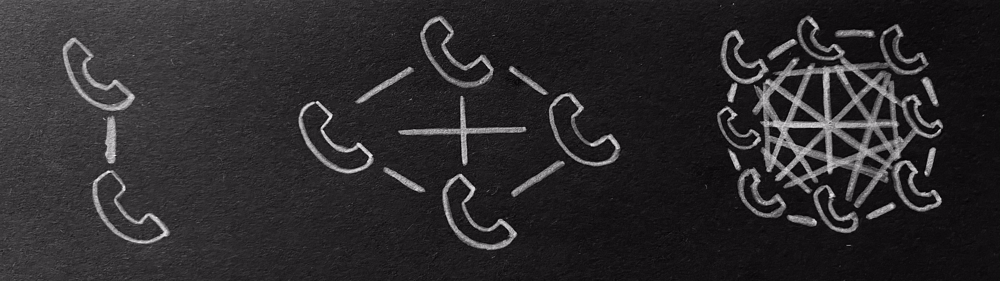

# The Network Effect
##### Digital Organization WS 2020
###### By Marieke Engel & Murielle Ingrid Kamegne 

---

## Imagine that ... 

---

## The concept of a Network Effect

- A phenomena whereby an increased number of people improve the value of a good/service

- As more people participate the network, the experience is more beneficial for the others and may encourage new participants to join

---

---

## Types of Network Effects

---

1. Direct Network Effect 
   
   _The same-side-effect_

- The value of a good goes up as the number of users goes up

- Telephone ex.: It is only useful if the people you'd like to reach also
    have telephones

---

2. Indiret Network Effect

   _The cross-side-effect_

-  The value of a good increases for one user group if a new user of different group joins the network

-  Two or more user groups are necessary

-  Only applicable to businesses platforms (that have two groups)

---

---
  
## Examples of Network Effects

> __Success__: Facebook

> __Failure__: Mini Disc

---

[Could you name other examples that grow through the Network Effect?](https://www.mentimeter.com/s/737a6ddc3727532e2593ee61d7bb2ea3/5e3e932f15b2)

---

## Other Examples

- Social Media
- Microsoft Office
- Apple/Apps
- Bitcoin
- Modern Stock Exchanges

---

## Cost-Benefit Analysis of Joining a Network

- Network users have to buy hardware
- Users have to pay a fee to use certain applications
- When reaching the critical mass, the cost of joining the 
  network is outweighed by the value of joining

---

## How can we optimize the Network Effect? (5 C's)

---

## 1. Connection

---

## 2. Communication

---

## 3. Curation

---

## 4. Collaboration

---

## 5. Community

---

## Critics of the Network Effect

- __Congestion__ is a negative network effect because too many users can slow down a network
- The __critical mass__ is fundamental for a network effect to work

---

## [Any Questions?](https://www.mentimeter.com/s/737a6ddc3727532e2593ee61d7bb2ea3/5e3e932f15b2)

---

## Thank YOU for listening!

---

## References

###### __Banton__ C. (2019). Network Effect. Retrieved 09/10/2020 from https://www.investopedia.com/terms/n/network-effect.asp

###### Corporatefinanceinstitut (2020). What is a Network Effect. Retrieved 09/10/2020 from https://corporatefinanceinstitute.com/resources/knowledge/economics/what-is-network-effect/

###### Economicshelp (2020). Network Effects - definition and examples. Retrieved from 09/10/2020 from https://www.economicshelp.org/blog/glossary/network-effects/

###### __Johnson__ N.J. (2020). What are Network Effects. Retrieved from 09/10/2020 from https://www.applicoinc.com/blog/network-effects/

